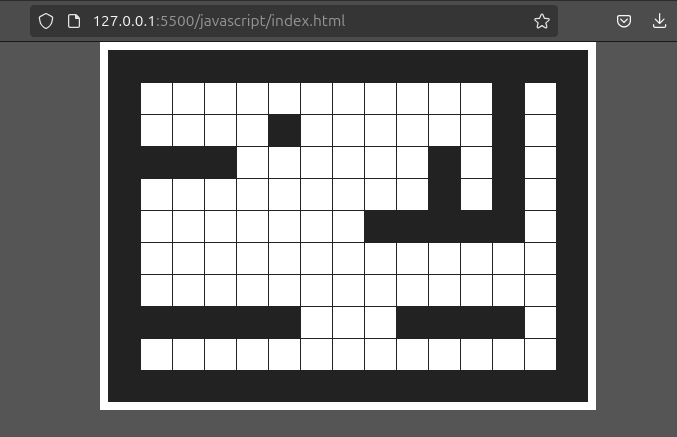

# Ray Casting in C
Implementation of raycasting in C

## Theory behind Wolfstein 3D raycasting 

The goal of the raycasting engine is simple. Given a 2D map, render the view of the player that is moving around in the map. At each step render a field of view that represents the view of the player. We use rays to figure out the distance between the wall and the player. If the distance is small, then the wall is closer. If the distance is larger, then the wall is further away. Based on the distance, we render a single column of the frame. The height of each wall depends on the distance. 

In a 320x200 display image, we send 320 rays. One for each column in the image. The result is fast rendering of a 3D scene in real-time. It was used for the game [Wolfstein 3D](https://en.wikipedia.org/wiki/Wolfenstein_3D), made in 1992. Games that implement raycasting for 3D rendering, have a very specific style. 

### Representing a Map

We need a map. Map represents the view of the scene. We need to know what the map looks like, by defining a matrix, where 0 represents empty space, and 1 represents a wall. We also need to know the tile size, meaning, how large is a tile in this map. 

A player moves within this map. A player has a direction that it moves in and a position. With simple input, we control if the player is hitting a wall next or not. The player will also tell us in what direction the player is looking. (Player and Map gives us key information for rendering the direction)

### Field of view and rays

Each player has a field of view. This is the view that is seen my the player and rendered. 
We use the FOV to find out how many rays we are going to have. 
We use the size of the projection plane, and the FOV in degrees to find out how many rays we need to cast. 

The algorithm for casting rays will then be: 
1. Subtract half of the FOV to get the first ray (left most ray). This is the column 0. 
2. Loop over each column for the projection plane:
    - Cast a ray
    - Trace ray until it hits a wall (we assume that the player is in a box environment)
    - If we hit a wall, store the distance between the wall and array
    - Increment the angle such that we are ready to cast the next ray

The image below shows the player with rays cast (not until wall hit).

### Resources 

Ray casting:  
https://en.wikipedia.org/wiki/Ray_casting

Wolfenstein 3D:  
https://en.wikipedia.org/wiki/Wolfenstein_3D